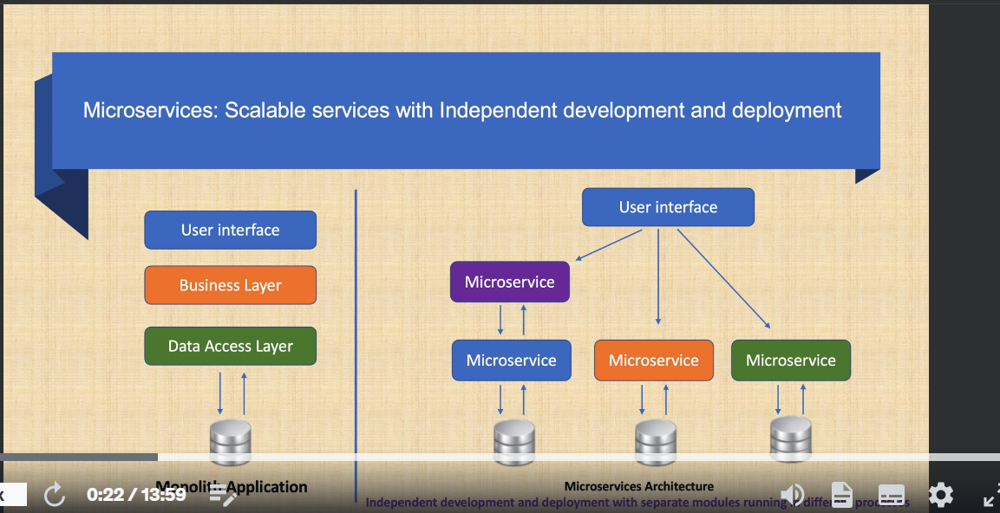
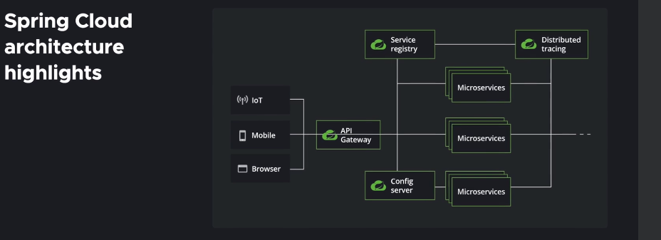

# Event-Driven: microservices: Spring Boot, Kafka, Elasticsearch

Master event-driven microservices architecture with patterns using Spring boot, Spring cloud, Kafka and Elasticsearch.

Dans ce cours, vous vous concentrerez sur le développement de microservices. Avec l'aide de microservices, vous pouvez développer et déployer indépendamment vos composants d'application. Vous pouvez également facilement faire évoluer les services en fonction des besoins en ressources de chaque service. Par exemple, vous pouvez mieux évoluer et créer davantage d'instances d'un service nécessitant davantage de requêtes.

Vous pouvez toujours utiliser les dernières versions pour Spring Boot, Spring Cloud et d'autres dépendances dans ce cours. Veuillez simplement suivre les conférences de la dernière section pour voir le code requis et les modifications de configuration pour les versions mises à jour. De plus, si vous souhaitez utiliser des sous-titres pendant le cours, vous pouvez activer les sous-titres sur les vidéos car toutes les conférences sont mises à jour avec des sous-titres manuscrits. Je suggère d'utiliser des sous-titres pour faciliter le suivi des cours.

Lors du passage d’une application monolithique à une architecture de microservices, certains défis surgiront du fait de la présence d’une application et d’un système distribués. Dans ce cours, vous apprendrez à relever ces défis à l'aide d'une architecture EDA (Event-Driven Architecture) avec Apache Kafka.

Avec une architecture événementielle ;

Vous allez véritablement découpler les services et créer des services résilients car un service n'a pas de communication directe avec d'autres services.

Vous utiliserez une communication asynchrone/non bloquante entre les services

Vous utiliserez un magasin d'événements/états (Kafka) et supprimerez l'état des services pour une meilleure évolutivité.

Vous développerez une architecture de microservices à partir de zéro en utilisant les plates-formes logicielles, technologies, bibliothèques et outils les plus récents, en suivant les meilleures pratiques, en appliquant des modèles de microservices et en utilisant Java, Spring Boot, Spring cloud, Spring Security, Kafka et Elasticsearch. Nous couvrirons également le sourcing d'événements et les services événementiels utilisant Kafka comme magasin d'événements.

Les modèles de microservices que vous mettrez en œuvre sont :

Configuration externalisée avec Spring Cloud Config

CQRS avec Kafka et recherche Elastic

Gestion des versions des API pour la gestion des versions des API Rest

Enregistrement et découverte de services avec Spring Cloud et Netflix Eureka

Passerelle API avec passerelle Spring Cloud

Disjoncteur avec Spring Cloud Gateway et Resilience4j

Limitation de débit avec Spring Cloud Gateway et Redis pour utiliser Redis comme limiteur de débit

Traçage distribué avec SLF4J MDC, Spring Cloud Sleuth et Zipkin

Agrégation de logs avec la pile ELK (Elasticsearch, Logstash et Kibana)

Équilibrage de charge côté client avec Spring Cloud Load Balancer

Base de données par service

Messagerie entre microservices à l'aide de Kafka

Vous mettrez également en œuvre les protocoles de connexion Spring Security Oauth 2.0 et OpenID pour l'authentification et l'autorisation à l'aide de Keycloak et JWT. L'utilisation d'Oauth pour l'autorisation des services et d'OpenID Connect pour l'authentification est largement utilisée dans l'architecture des microservices avec la sécurité Spring Boot.

Un autre sujet important sur lequel vous vous concentrerez est la surveillance des microservices. Vous utiliserez l'actionneur Spring Boot et Prometheus avec Micrometer qui peuvent être utilisés pour obtenir des mesures telles que la santé, le nombre de threads en cours d'exécution, le nombre de requêtes, le temps de réponse et l'utilisation de la mémoire. Vous apprendrez également à utiliser Grafana pour créer un joli tableau de bord permettant de visualiser les métriques que vous avez obtenues à l'aide de l'actionneur Spring Boot et de Prometheus.

Lors de l'introduction des microservices pilotés par événements, vous comprendrez les bases d'Apache Kafka en abordant les sujets Kafka, les partitions Kafka, les API de consommateur et de producteur Kafka, le client d'administration Kafka et la messagerie Avro.

Pour communiquer entre les microservices, outre l'utilisation de la messagerie Kafka, je présenterai également Kafka Streams et montrerai comment utiliser Kafka Streams pour créer un magasin d'état temporaire avec les données de streaming accumulées. Cette source de données temporaire sera ensuite consommée par un autre microservice.

Pour communiquer avec les magasins de données dans les microservices, j'utiliserai différentes dépendances Spring Data, telles que Spring Data JPA avec PostgreSQL, Spring Data Elasticsearch et Spring Kafka.

Pour la documentation Api, j'utiliserai la spécification Open Api 3 qui implémente Swagger 3.0. Open Api créera une interface RESTful pour une API et vous aidera à développer et utiliser facilement une API Rest.

Vous apprendrez également à utiliser Hateoas (Hypermedia comme moteur d'état d'application) dans une API Rest avec Spring Hateoas. Hateoas fournira des liens vers des ressources sur le serveur et mettra à jour la réponse de l'API REST avec ces liens pour interagir dynamiquement avec le client. Cela permettra de développer des API Rest de niveau 3.

Il y a également une section de développement réactif dans ce cours qui démontre l'interrogation réactive d'elasticsearch avec Reactive Spring, WebFlux, WebClient et Reactive Thymeleaf. Dans cette section, vous apprendrez à utiliser les composants réactifs Spring Webflux et Spring pour créer un flux asynchrone entre les microservices.

Vous utiliserez Spring Boot et Spring Cloud avec Docker pour développer des microservices prêts pour le cloud. Docker est une plate-forme de conteneurisation qui permet de regrouper des applications dans des conteneurs. Ces conteneurs peuvent ensuite s’exécuter dans n’importe quel environnement exécuté par Docker. Dans ce cours, vous créerez les images Docker des microservices que vous avez développés. Utilisez ensuite docker compose pour exécuter tous les conteneurs de microservices ensemble, ainsi que les autres dépendances telles que Kafka, Elasticsearch, Keycloak, Redis, Prometheus, Grafana et Zipkin . Au final, une seule commande « docker-compose up » suffira pour exécuter toute l'architecture de microservices avec les dépendances requises. Disposer de ces images Docker vous permettra de déployer facilement votre application sur n'importe quel fournisseur de cloud.

Ce que vous allez apprendre:

- Maîtrisez l’architecture des microservices avec Spring Boot et Spring Cloud Stack
- Développer des microservices événementiels avec Apache Kafka
- Comprendre la conteneurisation des microservices avec Docker et Docker Compose
- Apprenez les bases des courtiers Kafka, des sujets, des partitions, des producteurs, des consommateurs, du client administrateur, de la messagerie Avro, du zookeper et du registre de schémas.
- Apprenez les bases d'Elasticsearch, de l'API d'indexation et de l'API de requête.
- Implémentez des applications de messagerie basées sur Kafka avec Spring Kafka
- Comprendre l'indexation et les requêtes Elasticsearch avec Spring Data Elasticsearch
- Implémenter le modèle CQRS avec Kafka et Elasticsearch
- Implémenter le modèle de configuration Externaliser avec Spring Cloud Config
- Développer l'API Rest
- Implémenter le contrôle de version des API pour le contrôle de version des API Rest
- Implémenter Spring Data JPA avec PostgreSQL
- Comprendre l'enregistrement et la découverte des services avec Netflix Eureka et Spring Cloud
- Implémenter l'équilibrage de charge côté client avec Spring Cloud Load Balancer
- Comprendre le modèle Api Gateway avec Spring Cloud Gateway
- Implémenter un modèle de disjoncteur avec Spring Cloud Gateway et Resilience4j
- Implémenter la limitation de débit avec Spring Cloud Gateway et Redis
- Comprendre l'authentification et l'autorisation avec les protocoles de connexion Spring Security Oauth 2.0 et OpenID avec Keycloak à l'aide de JWT
- Implémenter la surveillance des microservices avec Spring Boot Actuator, Micrometer, Prometheus et Grafana
- Comprendre les modèles d'agrégation de journaux et la visualisation avec la pile ELK - Elasticsearch, Logstash et Kibana
- Comprendre l'utilisation de Hateoas dans les API Rest avec Spring Hateoas
- Implémentez Open Api v3 pour la documentation de l'API Restful avec Swagger v3
- Utilisez Thymeleaf et Bootstrap pour un front-end de base
- Comprendre le développement réactif et le flux asynchrone en interrogeant Elasticsearch de manière réactive avec Reactive Spring, WebFlux, WebClient et - Reactive Thymeleaf
- Apprenez le traçage distribué avec Slf4J MDC, Spring Cloud Sleuth et Zipkin
- Comprendre le modèle de base de données par service
- Comprendre l'utilisation des flux Kafka avec State Store
- Apprenez à diffuser des tweets depuis Twitter à l'aide de Twitter4J

## Introduction à l'architecture des webservices

With help of **microservices**, you'll be able to develop and deploy your application components independently.

>Une architecture de microservices est un type d'architecture d'application dans laquelle l'application est développée sous la forme d'un ensemble de services. Elle fournit le framework permettant de développer, déployer et gérer de manière indépendante des diagrammes et des services d'architecture de microservices.Dans une architecture de microservices, chaque microservice est un service unique conçu pour accueillir une fonctionnalité d'application et gérer des tâches discrètes. Chaque microservice communique avec d'autres services via des interfaces simples afin de répondre à des problématiques métier.
>À quoi sert l'architecture de microservices ? En général, les microservices sont utilisés pour accélérer le développement d'applications. Les architectures de microservices créées à l'aide de Java sont courantes, en particulier les architectures Spring Boot. Il est également courant de comparer les microservices à une architecture orientée services. Les deux architectures ont le même objectif, c'est-à-dire diviser des applications monolithiques en composants plus petits, mais elles ont des approches différentes.

You can easily scale services based on each service's own ressource requirements.

Use **spring boot** and **spring cloud stack** to develop microservices.
Spring stack reduc development time by providing most of dependencies with the help of auto configurations.

**Microservices patterns**:
- externalized configuration => Spring cloud config, separate and manage the configuration from the application itself. This will help you change the configuration without touching the application code, so that no compilation or build will be required to enable or disable a configuration.
- API versioning, URI vs Accept Header (content negotiation). In the communication of services, there should be some pre-defined contratcs that will allow you to send and receive request safely. What happens when the contract change in microservice?
You mmay need to appli some kind of versionning to prevent failure. They are differnet options to implement versioning, sush as using URL, or accept header, and i will be implementing examples of both, versionning with URI and versioning at ressource level by using the accept header
- service discovery => **Eureka**: while working with many microservices, you will need to register and find the service

## Tutoriel pour apprendre à mettre en place des patterns de microservices avec Spring Cloud

>Les microservices désignent un type d'architecture d'applications dans lequel un ensemble de services indépendants communiquent par l'intermédiaire d'API légères.Vous souvenez-vous de la dernière fois que vous avez consulté un site de vente en ligne ? Vous avez certainement utilisé la barre de recherche du site pour parcourir la liste des produits disponibles. Cette fonctionnalité de recherche constitue un service. Peut-être avez-vous vu des recommandations de produits similaires ou ajouté un article au panier ? Il s'agit également de services. Regroupez tous ces microservices, et vous obtenez une application complète.

>Les microservices désignent à la fois une architecture et une approche de développement logiciel qui consiste à décomposer les applications en éléments les plus simples, indépendants les uns des autres. Contrairement à une approche monolithique classique, selon laquelle tous les composants forment une entité indissociable, les microservices fonctionnent en synergie pour accomplir les mêmes tâches, tout en étant séparés. Chacun de ces composants ou processus est un microservice.

Chaque fonction principale d'une application peut exister indépendamment.

>Dans les architectures de microservices, les applications sont développées de façon à permettre l'exécution indépendante de chaque fonction clé. Ainsi, les équipes de développement peuvent créer et modifier de nouveaux composants pour s'adapter aux besoins métiers changeants sans perturber l'ensemble de l'application.

## Sources

[udemy](https://www.udemy.com/course/event-driven-microservices-spring-boot-kafka-and-elasticsearch/learn/lecture/23008254?start=45#overview)
[Developpez.com](https://xebia.developpez.com/tutoriels/spring/patterns-microservices-springcloud/)

